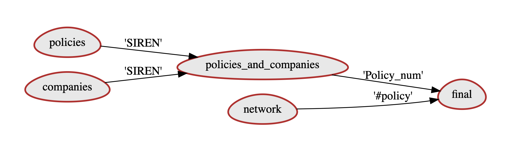

# notebook2diagram
The `notebook2diagram` helps you get entity-relation like diagrams directly from your notebooks.

## Use-cases
1. When working with multiple tables from multiple datasources, chances are that you'll get confused / overwhelmed at some point.
Wouldn't it be nice if we managed to automagically draw the graph, displaying the tables we merged together?
We could then keep track at the order the tables have been joined at a single glance.
2. Thus, this graph could help with people understanding what you've done, since the it acts like a documentation. And eventually let them pursue your work.

## Usage
```python
show_ER_graph('Demo.ipynb') # this leaves the notebook intact
```
A pop-up window opens showing the following graph (pdf format).
The latter can then be saved on disk.

